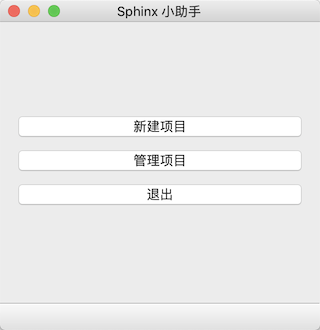

# sphinx小助手

## 开发工具：
PyCharm, PyQt5, PyQt-tools, Sphinx, PyInstaller

## 使用方法：
方法一： 下载main文件夹，安装需要的库，运行main
方法二： 下载打包好依赖的的app文件夹，直接运行（文件夹较大）

## 界面展示：

## 基本功能：
1. 新建项目。填写好文件目录、项目名称、作者、版本、语言等参数后，快速生成sphinx项目。并将生成项目的路径存入文本文件。
2. 管理项目。可选择之前生成的项目或者其他目录路径下的sphinx项目，进行安装基本插件和html、latex或pdf文件生成。

## 开发过程：
1. 使用 PyQt-tools 设计界面。
2. 将设计好的 UI 文件转换成 py 文件。
3. 使用 PyCharm 编写业务逻辑层代码。
4. 功能测试。
5. 使用 PyInstaller 进行程序打包。

## 开发过程中遇到的问题：
1. Mac安装PyQt5和PyQt-tools出现版本不兼容问题。
解决方法参考：[Support Mac/OS X](https://github.com/altendky/pyqt-tools/issues/12)
2. 使用rst2pdf生成中文pdf出现黑块。
尝试了很多方法，但该问题没有得到较好的解决方法。希望以后有同学能改进 PDF 输出支持。